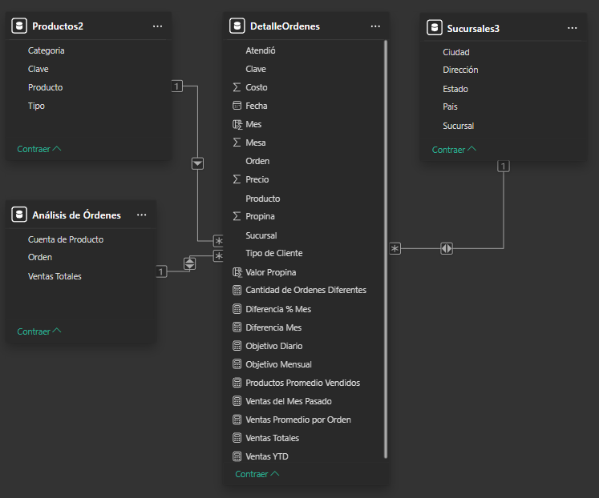
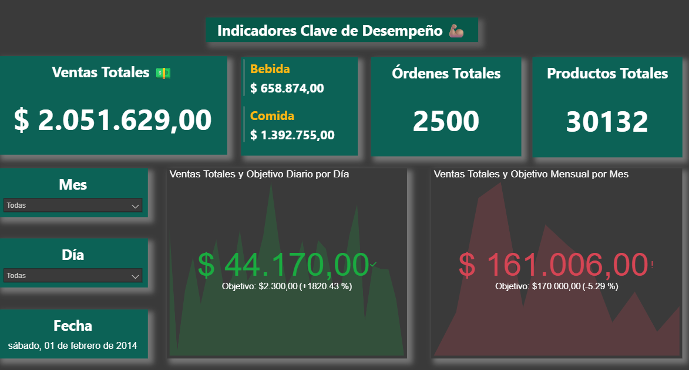
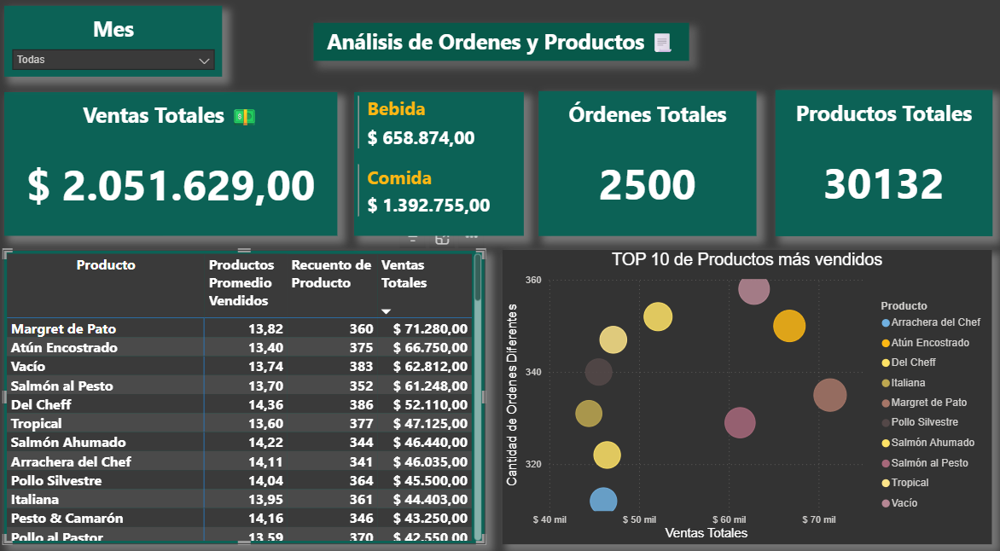
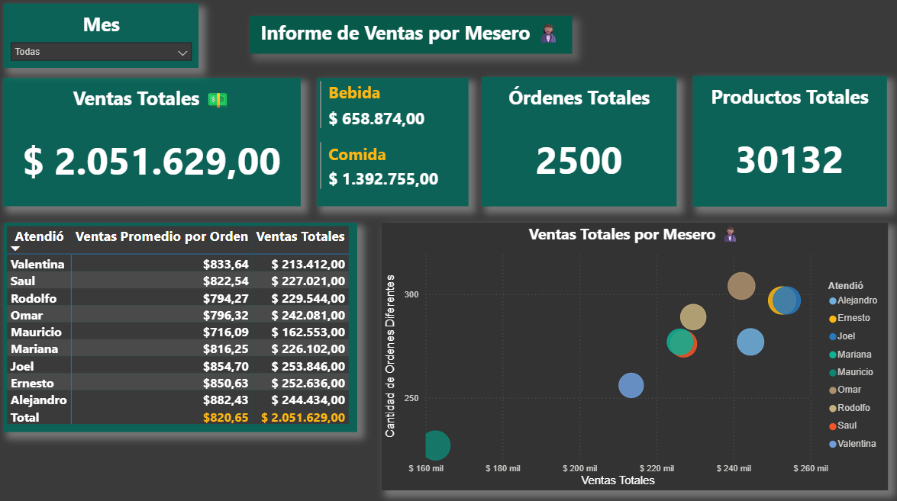
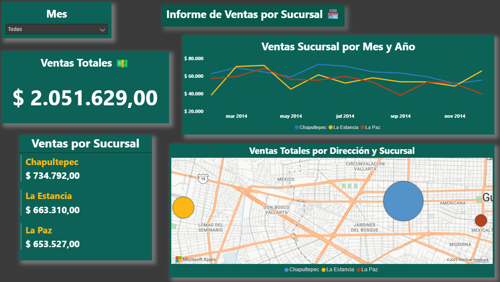
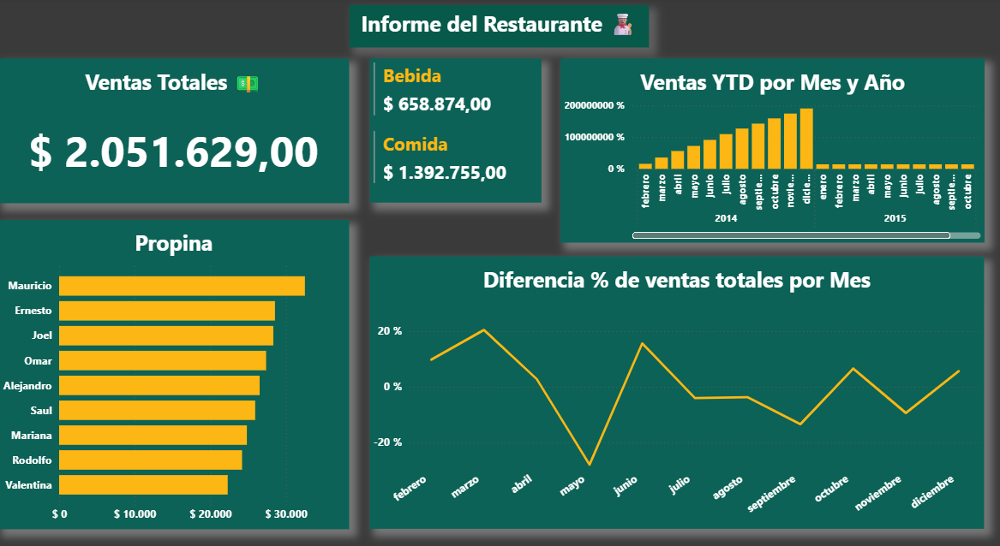

# Restaurante

## Proyecto Informe Cadena de Restaurante
    AUTOR:MANUEL CHANOURDIE LLEVILAO

## SITUACIÓN:
    Cadena de Restaurante X, con tres sucursales en México, solicita realizar informe detallado de las ventas totales por cada sucursal.

## Objetivo:
    El objetivo de este análisis es obtener indicadores medibles y concretos, para evaluar el estado y competitividad de las tiendas de la cadena.

    Se realizó un dashboard en Power BI para apoyar la decisión proveyendo los siguientes datos: 
    • Ventas Total.
    • Órdenes Totales.
    • Productos promedio por orden.
    • Ventas promedio por orden.
    • Ventas totales de las 3 Sucursales: Chapultepec, La Estancia y La Paz.

## Modelo de relación PBI

 

## 🚦 KPI (Indicadores Clave de Desempeño) 

## Ordenes y Productos vendidos

## Meseros:
    Indicadores de desempeño.

## Sucursales:
    Sus ventas, grafico de evolución en el año (2014) y Geoposición

## Informe:

